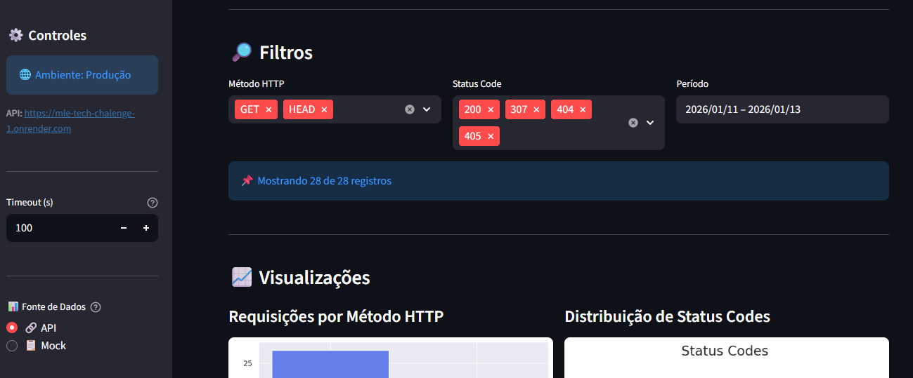

|      |
|:--------------------------------------------------------------------------------------------------------------------------------------------------------------------------------------------------------------------:|

# 📚 API Pública para Consulta de Livros – Projeto de Recomendação

## 📌 Descrição
Este projeto faz parte do Tech Challenge, cujo objetivo é aplicar de forma integrada os conhecimentos adquiridos na fase 1, desenvolvendo uma solução completa de dados (**web scraping** do site [Books to Scrape](https://books.toscrape.com/)), desde a coleta até a disponibilização via API pública com endpoint para integração com modelos de machine learning.(FastAPI + SQLite)

O desafio consiste em criar uma API pública para consulta de livros, alimentada por dados extraídos através de um sistema automatizado de web scraping do site Books to Scrape.

## Scraping
O script do web scraping localizado em `app/services/scraping.py` é responsável por:
- **Extrair os dados brutos do site**:
A função principal `scrape_books` tem o parâmetro opcional `pages`, se ele for passado na chamada da função, o scraping é realizado só naquele número de páginas, se não, a função realiza o web scraping em todo o site, passando página a página, obtendo o link de cada livro e, então, obtendo as informações dele na sua respectiva página.

- **Transformar e padronizar as informações coletadas**:
Algumas infomações, principalmente referentes a dinheiro foram formatadas para tirar o "£" e serem assumidas como numéricas. 

### Bibliotecas usadas
Para realizar o web scraping utilizamos a biblioteca BeautifulSoup com o parser lxml (por ser mais rápido e robusto).

### Execução do script
Há duas formas de executar o script:
- A primeira delas é via terminal com o comando python scraping.py (Dessa forma retornará as 2 primeiras páginas), dentro do diretório `services`, porém essa forma vai apenas printar as informações. 

- Já a segunda é integrada com a api, no endpoint `/api/v1/scraping/`. Essa forma irá popular o banco de dados com os livros e com as categorias, chamando os serviços de book e category, validando unicidade do registro para evitar quebras por duplicidade.

## Banco de Dados
Esse projeto armazena os registros de books, categories e api_logs em um SQLite. Toda a manipulação do banco de dados é feita usando a biblioteca `sqlalchemy`. Sua criação consiste na criação dos modelos das tabelas (presentes na pasta `app/models`) e execução do script `create_db.py` via terminal.

## API
A API foi projetada pensando em flexibilidade, escalabilidade, reutilização, boa organização arquitetural e facilidade de consumo por cientistas de dados, sistemas externos e serviços de recomendação. Para isso escolhemos criá-la usando FastAPI. 

A organização dos códigos da API se dá da seguinte forma:
- O `app/app.py` é responsável por orquestrar a criação da api, inclusão dos middleWares e das rotas.
- O diretório `api/routers` contêm os arquivos de cada domínio de rotas existente na api, ou seja, o arquivo `book.py`, por exemplo, contêm os códigos responsáveis por criar cada uma das rotas de book.
- As funções que integram com o banco de dados ficam no diretório `app/services` e são chamadas nas respectivas funções de criação do endpoint em `app/routers`.

### 📡 Endpoints da API
#### Core

GET /api/v1/scraping → Realiza o scraping e resgistro no banco de dados.

GET /api/v1/books → Lista todos os livros.

GET /api/v1/books/{id} → Detalhes de um livro específico.

GET /api/v1/books/search?title={title}&category={category} → Busca por título/categoria.

GET /api/v1/categories → Lista categorias disponíveis.

GET /api/v1/health → Status da API.

GET /callback → Rota para receber a autenticação

GET / → Rota não logada

GET /api/v1/home → Rota para home

GET /login → Rota para logar

GET /api/v1/logout → Rota para sair da api

#### Insights (opcionais)

GET /api/v1/stats/overview → Estatísticas gerais.

GET /api/v1/stats/categories → Estatísticas por categoria.

GET /api/v1/books/top-rated → Livros com melhor avaliação.

GET /api/v1/books/price-range?min={min}&max={max} → Livros por faixa de preço.

#### ML-ready (bônus)

*Observação: esses endpoints são planejados e **não** estão implementados atualmente.*

GET /api/v1/ml/features → Dados formatados para features. (planejado)

GET /api/v1/ml/training-data → Dataset para treinamento. (planejado)

POST /api/v1/ml/predictions → Endpoint para predições. (planejado)

#### Monitoramento & Analytics (bônus)

GET /api_logs → Informações de performance e logs das chamadas de api.


### 📊 Endpoints Detalhados (Diagramas de Sequência)

Todos os endpoints possuem diagramas de sequência em `docs/uml/` descrevendo o fluxo de execução:

#### Core
- [`sequence_scrape_populate.md`] (docs/uml/sequence_scrape_populate.md) — GET /scraping (scrape as informações do site)
- [`sequence_list_books.md`](docs/uml/sequence_list_books.md) — GET /books (lista todos os livros)
- [`sequence_get_book.md`](docs/uml/sequence_get_book.md) — GET /books/{id} (livro específico)
- [`sequence_search_books.md`](docs/uml/sequence_search_books.md) — GET /books/search (busca por título/categoria)
- [`sequence_list_categories.md`](docs/uml/sequence_list_categories.md) — GET /categories (lista categorias)
- [`sequence_health.md`](docs/uml/sequence_health.md) — GET /health (status da API)

#### Insights
- [`sequence_stats_overview.md`](docs/uml/sequence_stats_overview.md) — GET /stats/overview (estatísticas gerais)
- [`sequence_stats_categories.md`](docs/uml/sequence_stats_categories.md) — GET /stats/categories (estatísticas por categoria)
- [`sequence_top_rated.md`](docs/uml/sequence_top_rated.md) — GET /books/top-rated (livros melhor avaliados)
- [`sequence_price_range.md`](docs/uml/sequence_price_range.md) — GET /books/price-range (livros por faixa de preço)

### Documentação da API (Swagger) 
O próprio FastAPI monta a documentação no [link](https://mle-tech-chalenge-1.onrender.com/docs) usando as docstrings das funções de cada rota.

### 🔄 Versionamento da API

Esta API utiliza versionamento por URL, identificado pelo prefixo /api/v1.

O versionamento explícito permite:

- Evoluir a API sem quebrar integrações existentes
- Garantir compatibilidade para consumidores antigos
- Facilitar a manutenção e a introdução de novas funcionalidades

#### Estratégia adotada

- /api/v1

  Primeira versão estável da API, contendo os endpoints core de consulta de livros, categorias, scraping, estatísticas e monitoramento.

- Novas versões (v2, v3, …)
Serão criadas quando houver:

 - Mudanças incompatíveis no formato de resposta (breaking changes)
  - Alterações significativas na lógica dos endpoints
  - Introdução de novos fluxos, como autenticação diferente ou endpoints de ML em produção

#### Compatibilidade

- Versões antigas da API continuarão disponíveis por um período determinado, evitando impacto imediato nos consumidores.
- Correções de bugs e melhorias que não quebram compatibilidade poderão ser aplicadas dentro da mesma versão (v1).

#### Benefícios para Machine Learning

O versionamento é especialmente importante para cenários de Machine Learning, pois garante:

  - Reprodutibilidade de experimentos
  - Estabilidade nos dados consumidos por pipelines de treino
  - Segurança na evolução de features e datasets ao longo do tempo

## Autenticação
A autenticação da API aproveita o gerenciador de acesso do GitHub por meio da biblioteca `githubkit`, como pode ser visto em `app/services/auth_middleware.py`. Isso é interessante visto que não precisamos gerenciar os usuários.
Algumas rotas, como docs, api_logs são mantidas públicas estratégicamente falando para permitir previa visualização das funcionalidades da api e possibilitar integração com o streamlit de monitoramento.
Para isso foi preciso criar uma aplicação OAuth App no GitHub, onde obtemos o Client ID e o Client Secret e indicamos a url da home e a url de callback (o arquivo `app/.env` contêm as credenciais usadas na integração da nossa api com o GitHub e é usada a partir da classe Settings de `api/settings.py`. São elas: CLIENT_ID, CLIENT_SECRET, CallBack_URL e SECRET_KEY)

### Autenticação produtiva
Ao acessar nosso [site](https://mle-tech-chalenge-1.onrender.com/), a autenticação é bastante intuitiva, você apenas precisa ter uma conta no github e o restante será como uma autenticação normal.

### Autenticação sistêmica - para acessar em um  jupyter notebook
Nesse caso, a autenticação requer alguns passos:
- 1. instale:
       ```python
       !pip install requests_oauthlib --force-reinstall
       ```
- 2. Faça o passo de autenticação:
       ```python
       import requests
       from requests_oauthlib import OAuth2Session

       # Dados da aplicação registrada no GitHub
       client_id = "Ov23liTFpiWL4zMuc5Tx"
       client_secret = "e1494122a9f7dbf97e3659dd48f609ba961a56f1"
       redirect_uri = "https://mle-tech-chalenge-1.onrender.com/callback"


       # URLs do GitHub
       authorization_base_url = "https://github.com/login/oauth/authorize"
       token_url = "https://github.com/login/oauth/access_token"


       # Criar sessão OAuth2
       github = OAuth2Session(client_id, redirect_uri=redirect_uri)

       # Passo 1: Obter URL de autorização
       authorization_url, state = github.authorization_url(authorization_base_url)
       print("Acesse este link para autorizar:", authorization_url)
       ## Refaça esse passo na mesma aba da primeira vez para que o callback esteja unitilizado e funcione corretamente já que a sessão no github ainda estará ativa.
       ```
- 3. Depois da segunda execução, acesse a ferramenta DevTools do navegador para copiar o URL de redirecionamento completo que é a callback:
       ```Python
       # Cole o URL de redirecionamento completo em redirect_response
       redirect_response = "https://mle-tech-chalenge-1.onrender.com/callback/?code=88a0f15c4c658edb5a29&state=L3QXDVNaZNpXEndsbMNGr9eQXW3Lmu"

       # Passo 2: Trocar o código pelo token de acesso
       token = github.fetch_token(
       token_url,
       client_secret=client_secret,
       authorization_response=redirect_response
       )

       print("Token de acesso:", token)
       ```
- 4. Pronto! Basta consumir a api
       ```python
       response = github.get("https://mle-tech-chalenge-1.onrender.com/api/v1/stats/overview", )
       print(response.json())
       ```

## Monitoring & Logs
Para enriquecer os logs da nossa API fizemos uso da biblioteca `logging` em cada função e também no middleware `catch_exceptions_middleware` para centralizar a captura de exceptions.

Para monitorar a api, nós temos a captura de logs de cada rota também em `catch_exceptions_middleware`, usando a biblioteca `starlette`. A integração com o banco de dados é feita em `app/services/log.py`.

O dashboard de monitoramento está em https://mle-tech-chalenge-1-streamlit-qoud.onrender.com/

Abaixo, dois diagramas referentes aos logs.
- [`sequence_get_api_logs.md`](docs/uml/sequence_get_api_logs.md) — GET /api_logs (consulta de logs)
- [`class_api_log.md`](docs/uml/class_api_log.md) — Diagrama de classes do modelo `ApiLog`


## 🌐 Deploy

INCLUIR EXPLICAÇÃO DO RENDER

A API está disponível publicamente em: 

👉 [https://mle-tech-chalenge-1.onrender.com/](https://mle-tech-chalenge-1.onrender.com/)

## 📑 Plano de Integração com Modelos de Machine Learning
### Objetivo
Este plano descreve como a API pública de livros será integrada com modelos de Machine Learning (ML), garantindo que os dados coletados via web scraping sejam disponibilizados de forma escalável, reutilizável e prontos para consumo em sistemas de recomendação, análise estatística e predição.

### Fluxo de Integração com ML

#### Ingestão de Dados

Cientistas de dados acessam /api/v1/ml/training-data para obter as bases de dados em formato JSON para treinamento.

#### Análise dos dados

Cientista de dados usam /api/v1/stats/overview e /api/v1/stats/categories para analisar a distribuição dos dados por rating ou por categoria.
 
#### Preparação de Features

Endpoint /api/v1/ml/features fornece dados já normalizados, facilitando integração direta com frameworks como Scikit-learn, TensorFlow ou PyTorch.

#### Treinamento de Modelos

Modelos de recomendação são treinados usando os dados obtidos por requisições e armazenados em catalogos de modelos para versionamento dos modelos.

#### Deploy de Modelos

Modelos são expostos como serviços via FastAPI através do endpoint /api/v1/ml/predictions.

#### Consumo de Predições

Aplicações externas chamam /api/v1/ml/predictions enviando dados de entrada. API retorna recomendações personalizadas ou insights.

### Cenários de Uso
- Recomendação de Livros  
Usuário consulta /api/v1/ml/predictions e recebe sugestões baseadas em categoria e rating.

- Treinamento de Modelos de Classificação  
Cientistas de dados usam /api/v1/ml/training-data para treinar modelos que classificam livros por popularidade ou faixa de preço.

- Dashboards Analíticos  
Dados de /api/v1/stats/* podem ser integrados em ferramentas como Streamlit para visualização.

## ⚠️ Limitações Atuais e Próximos Passos

Embora a solução atenda plenamente aos objetivos propostos para esta fase do Tech Challenge, algumas limitações técnicas e funcionais foram identificadas e já estão mapeadas como próximos passos de evolução do projeto.

### Limitações Atuais

- Dependência da estrutura do site fonte

O processo de web scraping depende diretamente da estrutura HTML do site Books to Scrape. Alterações no layout ou nos seletores podem exigir ajustes no script de extração.

- Banco de dados SQLite
A aplicação utiliza SQLite por simplicidade e facilidade de setup local. Essa solução não é ideal para cenários de alta concorrência ou grandes volumes de dados.

- Scraping síncrono
O scraping é executado de forma síncrona, podendo impactar o tempo de resposta da API quando acionado em produção.

- Endpoints de Machine Learning não implementados
Os endpoints ML-ready (/ml/features, /ml/training-data, /ml/predictions) estão documentados e planejados, mas ainda não fazem parte da versão atual da API.

- Ausência de cache
Não há mecanismo de cache para respostas frequentes, o que pode gerar leituras repetidas do banco de dados.

### Próximos Passos (Evolução do Projeto)

- Migração do banco de dados
  - Substituir o SQLite por um banco relacional mais robusto, como PostgreSQL, com uso de Redis para cache de consultas frequentes.

- Scraping assíncrono e agendado
  - Implementar scraping assíncrono e/ou agendado utilizando filas (ex.: Celery, RQ ou SQS) ou orquestradores como Airflow.

- Implementação completa do pipeline ML

  - Disponibilizar datasets prontos para treino
  - Criar um modelo inicial de recomendação de livros
  - Versionar modelos e features

- Melhorias de segurança

  - Rate limiting
  - Controle de permissões por perfil
  - Tokens com expiração e refresh automatizado

- Observabilidade avançada

  - Métricas de performance (latência, throughput)
  - Alertas automatizados
  - Dashboards mais completos de monitoramento

- Escalabilidade e Cloud-Native

  - Containerização com Docker
  - Deploy com CI/CD
  - Suporte a múltiplas versões da API

## Diagrama Visual
```
   ┌─────────────┐
   │ Web Scraping│
   └──────┬──────┘
          │
   ┌──────▼──────┐
   │ Processing  │
   └──────┬──────┘
          │
   ┌──────▼──────┐
   │  Database   │
   └──────┬──────┘
          │
   ┌──────▼───────────────┐
   │     API REST         │
   │  /books /categories  │
   │  /ml/features        │
   │  /ml/training-data   │
   │  /ml/predictions     │
   └──────┬───────────────┘
          │
   ┌──────▼──────┐
   │   ML Model  │
   │ (Recommender│
   │   System)   │
   └──────┬──────┘
          │
   ┌──────▼───────────┐
   │ Consumers/Apps   │
   └──────────────────┘
```

---
## 🏗️ Arquitetura
Pipeline de dados:
1. **Ingestão** → Web Scraping dos livros.  
2. **Processamento** → Transformação e armazenamento em CSV.  
3. **API** → Disponibilização dos dados via endpoints RESTful.  
4. **Consumo** → Cientistas de dados e serviços de recomendação.  

👉 [Diagrama Arquitetural link](https://drive.google.com/file/d/1AE_LhUABf7asm-2K3pkIXUFuG20Aajez/view?usp=sharing) <!-- substitua pelo seu diagrama -->

---

### 📂 Estrutura do Repositório

```
.
├── README.md
├── app
|   ├── db
│   |   └── books.db
│   ├── __init__.py
│   ├── app.py
│   ├── dependencies.py
│   ├── .env
│   ├── settings.py
│   ├── models
│   │   ├── __init__.py
│   │   ├── base.py
│   │   ├── book.py
│   │   ├── category.py
│   │   ├── stats.py
│   │   └── logs.py
│   ├── routers
│   │   ├── __init__.py
│   │   ├── book.py
│   │   ├── category.py
│   │   ├── health.py
│   │   ├── scraping.py
│   │   ├── stats.py
|   |   ├── callback.py
│   │   ├── home.py
│   │   ├── login.py
│   │   ├── logout.py
│   │   ├── log.py
│   │   └── nolog.py
│   ├── services
│   │   ├── __init__.py
│   │   ├── book.py
│   │   ├── category.py
│   │   ├── scraping.py
│   │   ├── stats.py
│   │   ├── auth_middleware.py
│   │   └── log.py
│   └── utils
│       ├── __init__.py
│       └── constants.py
├── create_db.py
├── docs
│   ├── db_models.md
│   ├── scraping_architecture.drawio
│   └── uml/
│       ├── README.md
│       ├── class_api_log.md
│       ├── class_api_log.svg
│       ├── class_diagram.md
│       ├── class_diagram-1.png
│       ├── class_diagram-1.svg
│       ├── sequence_get_api_logs.md
│       ├── sequence_get_api_logs.svg
│       ├── sequence_get_book.md
│       ├── sequence_get_book-1.png
│       ├── sequence_get_book-1.svg
│       ├── sequence_health.md
│       ├── sequence_health-1.svg
│       ├── sequence_list_books.md
│       ├── sequence_list_books-1.svg
│       ├── sequence_list_categories.md
│       ├── sequence_list_categories-1.svg
│       ├── sequence_price_range.md
│       ├── sequence_price_range-1.svg
│       ├── sequence_scrape_populate.md
│       ├── sequence_scrape_populate-1.png
│       ├── sequence_scrape_populate-1.svg
│       ├── sequence_search_books.md
│       ├── sequence_search_books-1.svg
│       ├── sequence_stats_categories.md
│       ├── sequence_stats_categories-1.svg
│       ├── sequence_stats_overview.md
│       ├── sequence_stats_overview-1.svg
│       ├── sequence_top_rated.md
│       └── sequence_top_rated-1.svg
├── requirements.txt
├── requirements-dev.txt
├── .gitignore
└── tests
    ├── readme.md
    ├── conftest.py
    ├── test_auth_middleware.py
    ├── test_logs.py
    ├── test_models.py
    ├── test_routers.py
    ├── test_services.py
    └── __pycache__/
```

---

## 📌 Roadmap da execuçäo Projeto pelo time

Este documento apresenta o planejamento do projeto em formato **roadmap**, dividido em sprints de 3 semanas, com visão estilo **Gantt** e **heatmap visual** para destacar dependências entre tarefas. Bem tb como o Trello de acompanhamento da evolucao do projeto.

---


## 📊 Roadmap por Semana – Projeto API Pública para Consulta de Livros

| Tarefa                          | Semana 1 | Semana 2 | Semana 3 | Semana 4 | Semana 5 | Semana 6 |
|---------------------------------|:--------:|:--------:|:--------:|:--------:|:--------:|:--------:|
| Setup & Scraping                | 🟩🟩🟩     |          |          |          |          |          |
| API Core                        |          | → 🟦🟦🟦   |          |          |          |          |
| Deploy & Arquitetura            |          |          | → 🟨🟨🟨   |          |          |          |
| Insights & Estatísticas         |          |          |          | → 🟪🟪🟪   |          |          |
| Bônus & ML-ready                |          |          |          |          | → 🟥🟥🟥   |          |
| Finalização & Apresentação      |          |          |          |          |          | → 🟧🟧🟧   |

---

### 🎨 Legenda de cores
- 🟩 Setup & Scraping  
- 🟦 API Core  
- 🟨 Deploy & Arquitetura  
- 🟪 Insights & Estatísticas  
- 🟥 Bônus & ML-ready  
- 🟧 Finalização & Apresentação  


- [Trello de evolucao do projeto](https://trello.com/b/7Lrv480a/tech-chalenge-i)
---

## 📌 Observações

A aplicação possui uma suíte de testes. Execute `python -m pytest tests/ -v` localmente para ver o estado atual dos testes e consulte `tests/readme.md` para informações sobre cobertura e relatórios (HTML).

**Relatório HTML de cobertura:** [tests/htmlcov/index.html](tests/htmlcov/index.html)
    - Abra esse arquivo localmente no seu navegador para visualização interativa.

### Pré-requisitos
- Python 3.9+
- Pip ou Poetry
- Conta em render.com

### Passos
bash
#### Clonar repositório
```bash
git clone https://github.com/vagnerasilva/mle_tech_chalenge_1.git
cd seu-repo
```
#### Criar ambiente virtual
```bash
python -m venv venv
source venv/bin/activate   # Linux/Mac
venv\Scripts\activate      # Windows
```

#### Instalar dependências
```bash
pip install -r requirements.txt
```

#### Rodar API localmente
```bash
# Inicie o servidor de desenvolvimento
uvicorn app.app:app --reload
# Inicie o servidor de desenvolvimento em prod ( render)
uvicorn app.app:app --host 0.0.0.0 --port 10000 --reload
```

´´´

## Testes de response/requests 
Acesse [aqui](https://docs.google.com/document/d/1EdPdVxfSUCTN6JQGMQNRcEKVdiMOuGGmKpJxedEBpNM/edit?tab=t.0#heading=h.1b5y9g8r5jym)


## 🏆 Boas Práticas

### 🏗️ Organização e Arquitetura

#### Separação de Responsabilidades por Camadas

- **Routers**: Definição dos endpoints e contratos da API
- **Services**: Regras de negócio e integração com banco de dados
- **Models**: Definição das entidades e schemas
- **Utils**: Constantes e funções auxiliares

#### Estrutura de Projeto Modular

A modularização facilita:

- Testes automatizados
- Reutilização de código
- Evolução incremental do sistema

---

### 🌐 Boas Práticas em APIs REST

- Uso consistente de verbos HTTP (GET, POST, etc.)
- Endpoints nomeados de forma semântica e previsível
- Versionamento explícito via URL (`/api/v1`)
- Respostas padronizadas em formato JSON
- Uso adequado de códigos de status HTTP (200, 400, 401, 404, 500)

---

### 📝 Qualidade de Código

- Código escrito seguindo padrões da **PEP 8**
- Funções com responsabilidades bem definidas
- Evita duplicação de lógica (**DRY** – Don't Repeat Yourself)
- Comentários objetivos apenas quando necessário
- Tipagem explícita sempre que aplicável

---

### ⚠️ Tratamento de Erros e Logs

#### Centralização de Exceções

- Tratamento centralizado via middleware (`catch_exceptions_middleware`)
- Mensagens de erro claras, sem expor informações sensíveis

#### Logs Estruturados

Utilizados para:
# Streamlit com statisticas do consumo da api 
👉 Link Monitoramento: [Streamlit](https://mle-tech-chalenge-1-streamlit-qoud.onrender.com/)



- Registro de erros e stack traces
- Execução de endpoints
- Monitoramento de performance
- Rastreamento de eventos importantes

👉 repositorio do streamlit de monitoramento: [https://github.com/vagnerasilva/mle_tech_chalenge_1_streamlit/](https://github.com/vagnerasilva/mle_tech_chalenge_1_streamlit/)

# 📑 Plano de Integração com Modelos de Machine Learning
## Objetivo
Este plano descreve como a API pública de livros será integrada com modelos de Machine Learning (ML), garantindo que os dados coletados via web scraping sejam disponibilizados de forma escalável, reutilizável e prontos para consumo em sistemas de recomendação, análise estatística e predição.

### 🔐 Segurança

- Uso de autenticação para proteger rotas sensíveis
- Separação entre rotas públicas e rotas autenticadas
- Variáveis sensíveis isoladas em arquivos de ambiente (`.env`)
- Evita hardcode de segredos no código-fonte
- Integração com OAuth2 via GitHub para autenticação

---

### 🧪 Testes Automatizados

#### Cobertura de Testes

A suíte de testes abrange:

- Models
- Services
- Routers
- Middleware de autenticação

#### Ferramentas e Relatórios

- Uso de **pytest** para execução e organização dos testes
- Relatório de cobertura para acompanhamento da qualidade
- Cobertura atual: **70%** (confira [tests/htmlcov/index.html](tests/htmlcov/index.html))

---

### 🤖 Preparação para Machine Learning (ML-Ready)

- Dados estruturados e normalizados no banco
- Endpoints planejados para:
  - Extração de datasets
  - Geração de features
  - Consumo por pipelines de ML
- Foco em reprodutibilidade e versionamento dos dados

---

### 📊 Observabilidade e Monitoramento

- Registro de logs de todas as requisições
- Persistência de métricas básicas no banco de dados
- Dashboard externo para visualização de uso e performance
- Endpoint dedicado `/api_logs` para consulta de logs

# 🎥 Vídeo de Apresentação
👉 Link do Vídeo


