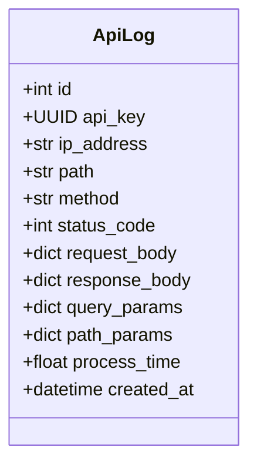

# Diagrama de Classes: ApiLog

```mermaid
classDiagram
    class ApiLog {
        +int id
        +UUID api_key
        +str ip_address
        +str path
        +str method
        +int status_code
        +dict request_body
        +dict response_body
        +dict query_params
        +dict path_params
        +float process_time
        +datetime created_at
    }
```
