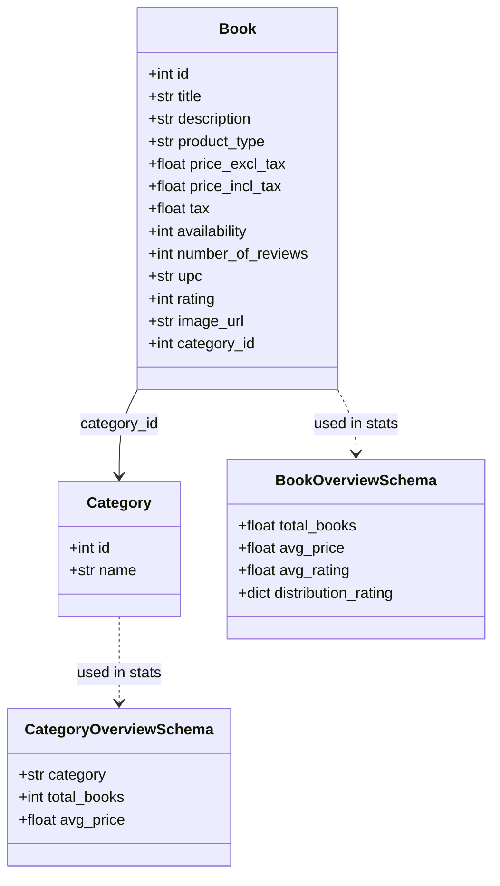

# Diagrama de Classes (Mermaid)

```mermaid
classDiagram
    class Book {
        +int id
        +str title
        +str description
        +str product_type
        +float price_excl_tax
        +float price_incl_tax
        +float tax
        +int availability
        +int number_of_reviews
        +str upc
        +int rating
        +str image_url
        +int category_id
    }

    class Category {
        +int id
        +str name
    }

    class BookOverviewSchema {
        +float total_books
        +float avg_price
        +float avg_rating
        +dict distribution_rating
    }

    class CategoryOverviewSchema {
        +str category
        +int total_books
        +float avg_price
    }

    Book --> Category : category_id
    Book ..> BookOverviewSchema : used in stats
    Category ..> CategoryOverviewSchema : used in stats

%% notas
%% rating possui constraint (0..5)
%% upc é único
```
