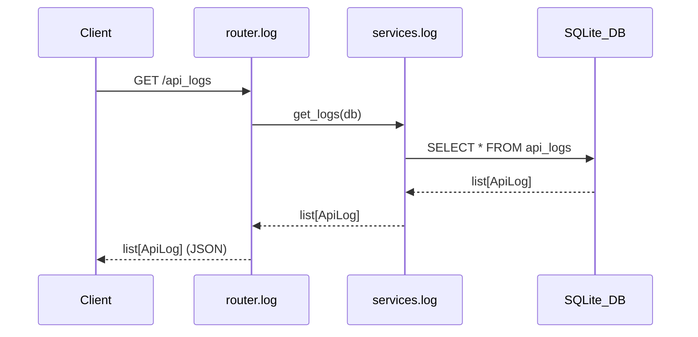

# Sequência: GET /api_logs

```mermaid
sequenceDiagram
    participant Client
    participant Router as router.log
    participant Service as services.log
    participant DB as SQLite_DB

    Client->>Router: GET /api_logs
    Router->>Service: get_logs(db)
    Service->>DB: SELECT * FROM api_logs
    DB-->>Service: list[ApiLog]
    Service-->>Router: list[ApiLog]
    Router-->>Client: list[ApiLog] (JSON)
```
