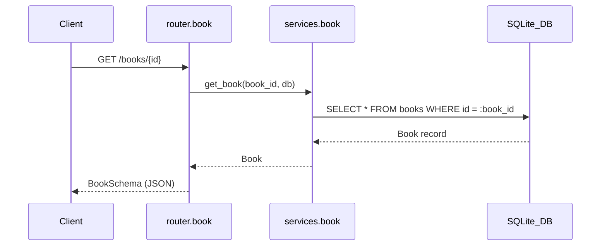

# Sequência: GET /books/{id} (Mermaid)

```mermaid
sequenceDiagram
    participant Client
    participant Router as router.book
    participant Service as services.book
    participant DB as SQLite_DB

    Client->>Router: GET /books/{id}
    Router->>Service: get_book(book_id, db)
    Service->>DB: SELECT * FROM books WHERE id = :book_id
    DB-->>Service: Book record
    Service-->>Router: Book
    Router-->>Client: BookSchema (JSON)
```
