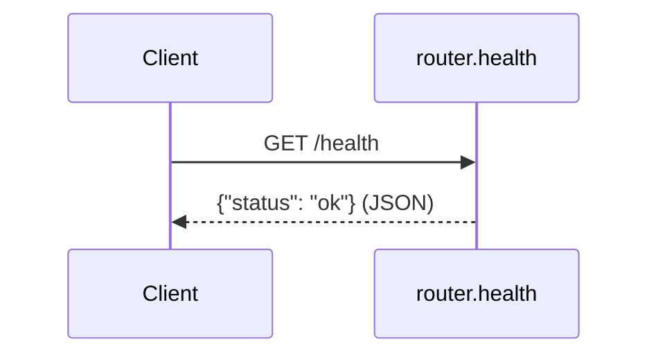

# Sequência: GET /health (Mermaid)

```mermaid
sequenceDiagram
    participant Client
    participant Router as router.health
    
    Client->>Router: GET /health
    Router-->>Client: {"status": "ok"} (JSON)
```
