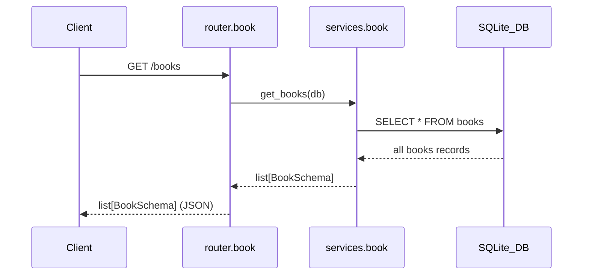

# Sequência: GET /books 

```mermaid
sequenceDiagram
    participant Client
    participant Router as router.book
    participant Service as services.book
    participant DB as SQLite_DB

    Client->>Router: GET /books
    Router->>Service: get_books(db)
    Service->>DB: SELECT * FROM books
    DB-->>Service: all books records
    Service-->>Router: list[BookSchema]
    Router-->>Client: list[BookSchema] (JSON)
```
