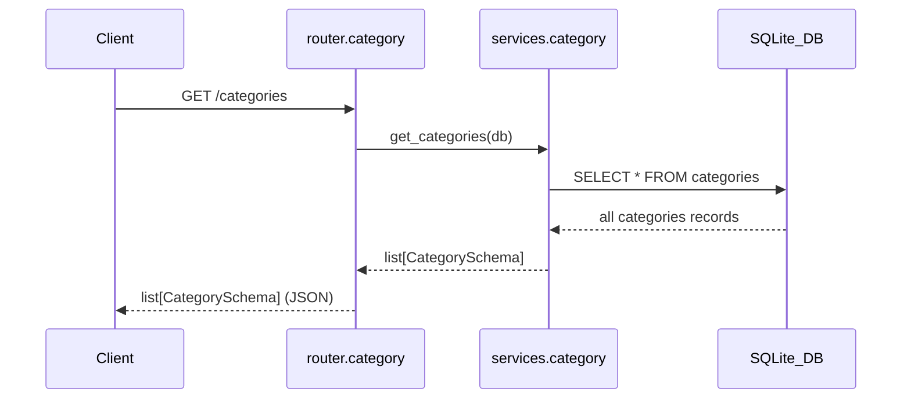

# Sequência: GET /categories 

```mermaid
sequenceDiagram
    participant Client
    participant Router as router.category
    participant Service as services.category
    participant DB as SQLite_DB

    Client->>Router: GET /categories
    Router->>Service: get_categories(db)
    Service->>DB: SELECT * FROM categories
    DB-->>Service: all categories records
    Service-->>Router: list[CategorySchema]
    Router-->>Client: list[CategorySchema] (JSON)
```
