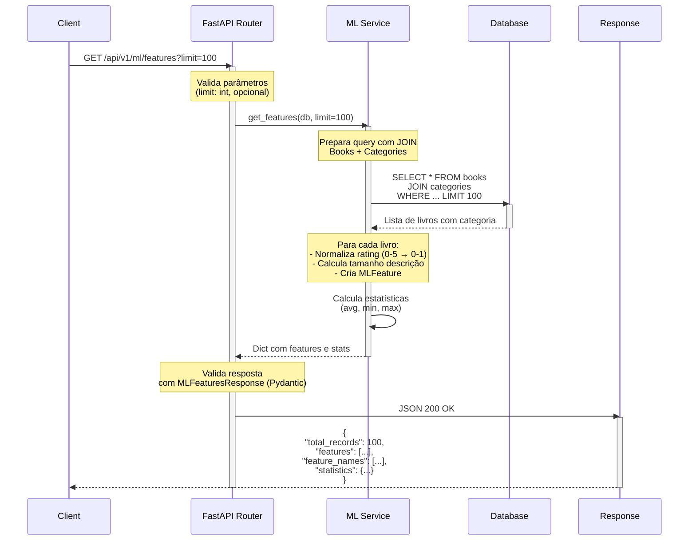

# Diagrama de Sequência: GET /api/v1/ml/features

## Fluxo de Execução



## Detalhes do Endpoint

- **Rota:** `GET /api/v1/ml/features`
- **Descrição:** Retorna features normalizadas para modelos de ML
- **Query Parameters:** 
  - `limit` (opcional, int): Limita quantidade de registros
- **Status Code:** 200 OK
- **Modelo de Resposta:** `MLFeaturesResponse`

## Características

1. **Normalização de Features**
   - Rating: De 0-5 para 0-1 (divide por 5.0)
   - Preço: Mantém valor original em unidade monetária
   - Description Length: Tamanho em caracteres

2. **Estatísticas Incluídas**
   - Ratings: média, mínimo, máximo
   - Preços: média, mínimo, máximo
   - Reviews: média de avaliações
   - Disponibilidade: média em estoque

3. **Tratamento de Erros**
   - 500: Erro ao processar features

## Exemplo de Resposta

```json
{
  "total_records": 100,
  "features": [
    {
      "book_id": 1,
      "title": "The Great Gatsby",
      "rating": 0.8,
      "price": 29.99,
      "availability": 50,
      "number_of_reviews": 150,
      "category_id": 1,
      "category_name": "Fiction",
      "description_length": 500
    }
  ],
  "feature_names": ["book_id", "rating", "price", "availability", "number_of_reviews", "category_id", "description_length"],
  "statistics": {
    "rating_avg": 0.75,
    "rating_min": 0.2,
    "rating_max": 1.0,
    "price_avg": 25.50,
    "price_min": 5.99,
    "price_max": 89.99,
    "reviews_avg": 120,
    "availability_avg": 40
  }
}
```

## Caso de Uso

Cientista de dados obtém features normalizadas para:
- Treinamento de modelos ML
- Análise exploratória de dados
- Criação de pipelines de processamento
