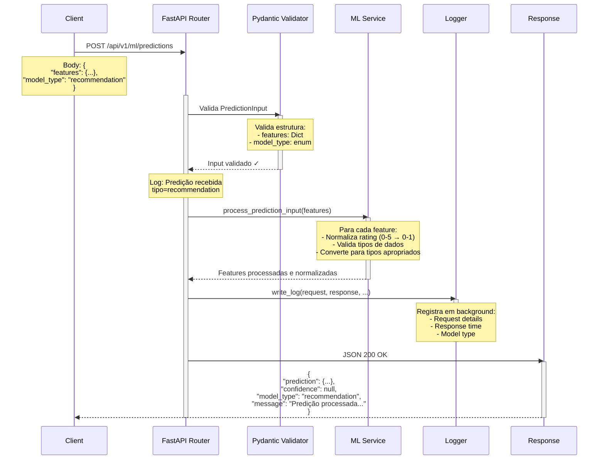

# Diagrama de Sequência: POST /api/v1/ml/predictions

## Fluxo de Execução



## Detalhes do Endpoint

- **Rota:** `POST /api/v1/ml/predictions`
- **Descrição:** Recebe e processa predições de modelos ML
- **Content-Type:** application/json
- **Status Code:** 200 OK
- **Modelo de Request:** `PredictionInput`
- **Modelo de Response:** `PredictionOutput`

## Estrutura de Request

```json
{
  "features": {
    "rating": 4.5,
    "price": 29.99,
    "number_of_reviews": 150,
    "category_id": 1,
    "availability": 50
  },
  "model_type": "recommendation"
}
```

## Tipos de Modelo Suportados

- **`recommendation`** - Modelo de recomendação de livros

## Processamento de Features

```
Input Features:
  rating: 4.5 (escala 0-5)
  price: 29.99
  number_of_reviews: 150
  category_id: 1
  availability: 50

Processing:
  ✓ Normaliza rating: 4.5 / 5.0 = 0.9
  ✓ Valida tipos
  ✓ Converte para format apropriado

Output:
  rating: 0.9 (escala 0-1)
  price: 29.99
  number_of_reviews: 150
  category_id: 1
  availability: 50
```

## Estrutura de Response

```json
{
  "prediction": {
    "rating": 0.9,
    "price": 29.99,
    "number_of_reviews": 150,
    "category_id": 1,
    "availability": 50
  },
  "confidence": null,
  "model_type": "recommendation",
  "message": "Predição do tipo 'recommendation' recebida e processada com sucesso"
}
```

## Tratamento de Erros

### 400 Bad Request
```json
{
  "detail": "Dados de entrada inválidos: ..."
}
```

**Causas possíveis:**
- Features faltando ou malformadas
- Type mismatch nos valores
- Model_type inválido

### 500 Internal Server Error
```json
{
  "detail": "Erro ao processar predição: ..."
}
```

**Causas possíveis:**
- Erro ao normalizar dados
- Falha na lógica de processamento

## Logging Automático

Toda predição é registrada em background com:
- Timestamp da requisição
- Tempo de processamento
- Features enviadas
- Modelo utilizado
- Status da resposta

## Caso de Uso

Aplicação externa integrada com modelos ML para:
- Enviar predições de sistemas externos
- Registrar histórico de recomendações
- Validar qualidade das predições
- Monitorar performance do modelo

## Exemplo de Integração com Scikit-learn

```python
# Seu modelo treinado
model = load_model('recommendation_model.pkl')

# Receber dados do endpoint
response = requests.post(
    'http://localhost:8000/api/v1/ml/predictions',
    json={
        'features': {
            'rating': 4.5,
            'price': 29.99,
            'number_of_reviews': 150,
            'category_id': 1,
            'availability': 50
        },
        'model_type': 'recommendation'
    }
)

# Processar resposta
if response.status_code == 200:
    result = response.json()
    print(f"Predição: {result['prediction']}")
    print(f"Tipo: {result['model_type']}")
```
