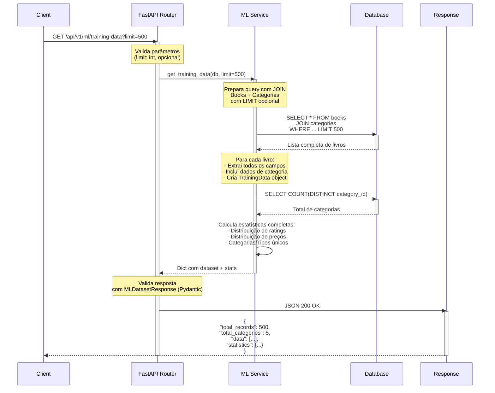

# Diagrama de Sequência: GET /api/v1/ml/training-data

## Fluxo de Execução



## Detalhes do Endpoint

- **Rota:** `GET /api/v1/ml/training-data`
- **Descrição:** Retorna dataset completo para treinamento de modelos
- **Query Parameters:**
  - `limit` (opcional, int): Limita quantidade de registros
- **Status Code:** 200 OK
- **Modelo de Resposta:** `MLDatasetResponse`

## Campos do Dataset

```
Dados Básicos:
- book_id: Identificador único
- title: Título do livro
- description: Descrição completa
- product_type: Tipo de produto (Hardcover, Paperback, etc)

Dados Financeiros:
- price_excl_tax: Preço sem imposto
- price_incl_tax: Preço com imposto
- tax: Valor do imposto

Dados de Avaliação:
- rating: Avaliação (0-5)
- number_of_reviews: Número de avaliações

Dados de Inventário:
- availability: Quantidade disponível
- upc: Universal Product Code

Dados de Categorização:
- category_id: ID da categoria
- category_name: Nome da categoria
- image_url: URL da imagem
```

## Estatísticas Incluídas

```json
{
  "rating_distribution": {
    "avg": 3.8,
    "min": 1,
    "max": 5
  },
  "price_distribution": {
    "avg": 25.50,
    "min": 5.99,
    "max": 89.99
  },
  "reviews_avg": 120,
  "unique_categories": 5,
  "unique_product_types": 3
}
```

## Exemplo de Resposta Parcial

```json
{
  "total_records": 500,
  "total_categories": 5,
  "data": [
    {
      "book_id": 1,
      "title": "The Great Gatsby",
      "description": "A classic novel about...",
      "product_type": "Hardcover",
      "price_excl_tax": 25.00,
      "price_incl_tax": 29.99,
      "tax": 4.99,
      "availability": 50,
      "number_of_reviews": 150,
      "upc": "9780123456789",
      "rating": 4,
      "category_id": 1,
      "category_name": "Fiction",
      "image_url": "https://example.com/image.jpg"
    }
  ],
  "statistics": {
    "rating_distribution": {"avg": 3.8, "min": 1, "max": 5},
    "price_distribution": {"avg": 25.50, "min": 5.99, "max": 89.99},
    "reviews_avg": 120,
    "unique_categories": 5,
    "unique_product_types": 3
  }
}
```

## Caso de Uso

Cientista de dados obtém dataset completo para:
- Treinar modelos de recomendação
- Análise exploratória e estatística
- Validação de hipóteses
- Criação de features customizadas
