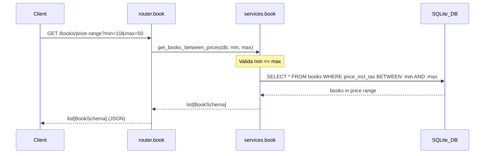

# Sequência: GET /books/price-range 

```mermaid
sequenceDiagram
    participant Client
    participant Router as router.book
    participant Service as services.book
    participant DB as SQLite_DB

    Client->>Router: GET /books/price-range?min=10&max=50
    Router->>Service: get_books_between_prices(db, min, max)
    Note over Service: Valida min <= max
    Service->>DB: SELECT * FROM books WHERE price_incl_tax BETWEEN :min AND :max
    DB-->>Service: books in price range
    Service-->>Router: list[BookSchema]
    Router-->>Client: list[BookSchema] (JSON)
```
