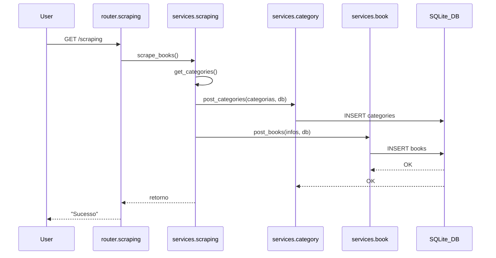

# Sequência: Scraping -> Popular DB (Mermaid)

```mermaid
sequenceDiagram
    participant User
    participant Router as router.scraping
    participant Scraping as services.scraping
    participant CategorySvc as services.category
    participant BookSvc as services.book
    participant DB as SQLite_DB

    User->>Router: GET /scraping
    Router->>Scraping: scrape_books()
    Scraping->>Scraping: get_categories()
    Scraping->>CategorySvc: post_categories(categorias, db)
    CategorySvc->>DB: INSERT categories
    Scraping->>BookSvc: post_books(infos, db)
    BookSvc->>DB: INSERT books
    DB-->>BookSvc: OK
    DB-->>CategorySvc: OK
    Scraping-->>Router: retorno
    Router-->>User: "Sucesso"
```
