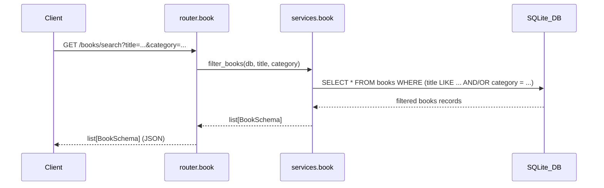

# Sequência: GET /books/search (Mermaid)

```mermaid
sequenceDiagram
    participant Client
    participant Router as router.book
    participant Service as services.book
    participant DB as SQLite_DB

    Client->>Router: GET /books/search?title=...&category=...
    Router->>Service: filter_books(db, title, category)
    Service->>DB: SELECT * FROM books WHERE (title LIKE ... AND/OR category = ...)
    DB-->>Service: filtered books records
    Service-->>Router: list[BookSchema]
    Router-->>Client: list[BookSchema] (JSON)
```
