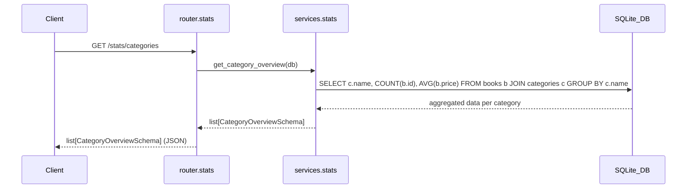

# Sequência: GET /stats/categories 

```mermaid
sequenceDiagram
    participant Client
    participant Router as router.stats
    participant Service as services.stats
    participant DB as SQLite_DB

    Client->>Router: GET /stats/categories
    Router->>Service: get_category_overview(db)
    Service->>DB: SELECT c.name, COUNT(b.id), AVG(b.price) FROM books b JOIN categories c GROUP BY c.name
    DB-->>Service: aggregated data per category
    Service-->>Router: list[CategoryOverviewSchema]
    Router-->>Client: list[CategoryOverviewSchema] (JSON)
```
