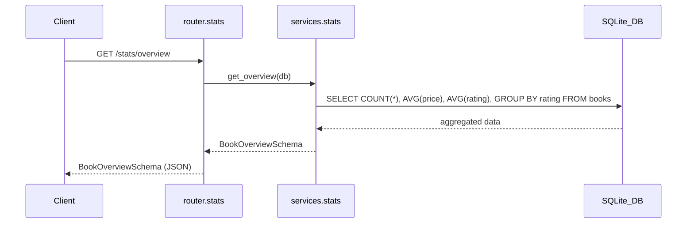

# Sequência: GET /stats/overview 

```mermaid
sequenceDiagram
    participant Client
    participant Router as router.stats
    participant Service as services.stats
    participant DB as SQLite_DB

    Client->>Router: GET /stats/overview
    Router->>Service: get_overview(db)
    Service->>DB: SELECT COUNT(*), AVG(price), AVG(rating), GROUP BY rating FROM books
    DB-->>Service: aggregated data
    Service-->>Router: BookOverviewSchema
    Router-->>Client: BookOverviewSchema (JSON)
```
