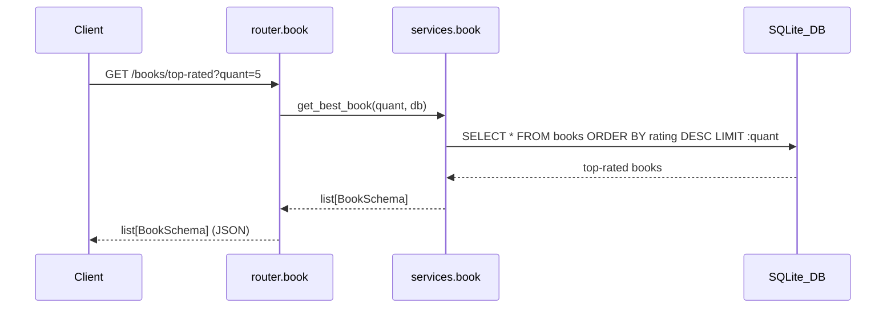

# Sequência: GET /books/top-rated 

```mermaid
sequenceDiagram
    participant Client
    participant Router as router.book
    participant Service as services.book
    participant DB as SQLite_DB

    Client->>Router: GET /books/top-rated?quant=5
    Router->>Service: get_best_book(quant, db)
    Service->>DB: SELECT * FROM books ORDER BY rating DESC LIMIT :quant
    DB-->>Service: top-rated books
    Service-->>Router: list[BookSchema]
    Router-->>Client: list[BookSchema] (JSON)
```
